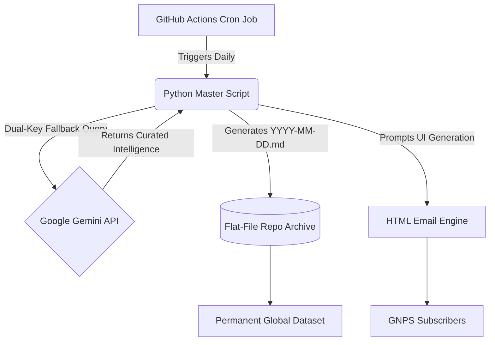

#  The Gemini Chronicle Agent (TGCA)


> A fully autonomous, serverless intelligence pipeline that researches, writes, and permanently archives a daily global news briefing using Google's Gemini API and GitHub Actions.

Runs daily via GitHub Actions **→** Queries Gemini **→** Generates Markdown **→** Commits to Repo **→** Sends HTML Email.

---

##  The Origin Story

Every useful system starts with friction. This one started with my mornings.

*   **Phase 1: The Infinite Scroll:** I am deeply interested in global events, but staying informed meant jumping across dozens of sources every morning. It was fragmented, inefficient, and forgettable. By the next day, most of what I read was gone.
*   **Phase 2: The Manual Prompt:** To fix this, I built a structured deep-search prompt and ran it through Gemini daily. The output was concise and high-signal. But this created a new problem: digital clutter. Chat logs piled up, organization broke down, and busy days meant skipping the process entirely.
*   **Phase 3: The Broken Archive:** I tried manually saving outputs into dated files. That failed quickly. Manual effort did not scale, file organization became messy, and commits were inconsistent. The solution became another chore.
*   **Phase 4: The Breakthrough:** The turning point was a simple question: *What if this system ran entirely on its own and archived itself?* 

That led to discovering GitHub Actions as a serverless execution layer. From there, I built a fully automated pipeline that runs daily without intervention, queries Gemini for real-time intelligence, generates a clean Markdown report, commits it directly to this repository, and sends a formatted HTML briefing via email. 

Now, the system runs automatically, and the archive grows every day.

---

## ⚙️ System Architecture

TGCA uses GitHub as a complete execution and storage environment.


### 1. The Pulse (GitHub Actions)
A scheduled YAML workflow acts as a cron job, spinning up a fresh Linux environment daily.

### 2. The Brain (Gemini API)
A custom Python script that:
*   Authenticates securely using environment secrets.
*   Uses a dual-key failover (`GEMINI_API_KEY`, `GEMINI_API_KEY_2`) for enterprise reliability.
*   Performs live web-informed queries.
*   Generates a structured global intelligence report.

### 3. The Ledger (Flat-File Archive)
*   Automatically creates year-based directories (e.g., `/2026/`).
*   Stores each report identically as `YYYY-MM-DD.md`.
*   Maintains a clean chronological dataset with zero database overhead.

### 4. The Designer (HTML Generation)
The Markdown report is passed back to Gemini with strict UI instructions to generate a responsive, dynamically themed HTML newsletter for the **GNPS (Global News Premium Subscribers)** extension.

---

## Example Output
```text
TGCA/
├── 2026/
│   ├── 2026-03-27.md
│   ├── 2026-03-28.md
│   └── 2026-03-29.md
└── main.py
```
*Each file contains a structured daily intelligence brief covering global events, tech trends, and economic shifts.*

---

##  Long-Term Vision

This system is designed to accumulate value over time.

*   **In 1 Year:** Approximately 365 structured reports forming a complete reference of global events.
*   **In 3–5 Years:** A clean, massive dataset that can be used for trend analysis, pattern tracking, and historical queries.
*   **In 10–20 Years:** A compact archive representing a long-term record of global developments and AI-generated summaries.

All data is stored purely in Markdown, ensuring ultimate portability and long-term accessibility across any future technology.

---

##  Setup and Deployment

### 1. Add Repository Secrets
Navigate to **Settings** → **Secrets and variables** → **Actions** and add your credentials:
*   `GEMINI_API_KEY`
*   `GEMINI_API_KEY_2` (Optional Fallback)
*   `EMAIL_USERNAME`
*   `EMAIL_PASSWORD` (App Password)

### 2. Install Dependencies
Ensure your workflow includes the required SDKs:
```bash
pip install google-genai
```

### 3. Configure the Cron Job
Edit your workflow file to set your preferred delivery schedule (Note: GitHub Actions uses UTC time):
```yaml
# .github/workflows/main.yml
on:
  schedule:
    - cron: '30 23 * * *' # Runs at 5:00 AM IST
```

---

##  Conclusion

This project began as a way to reduce noise and organize information. It evolved into an enterprise-grade system that removes manual effort, produces consistent output, and builds long-term value automatically.

Instead of consuming information reactively, this pipeline curates, stores, and compounds it over time. 

**Fork the repository, add your API keys, and let the system run.**

---
*Built with Python, GitHub Actions, and Google Gemini.*
```
